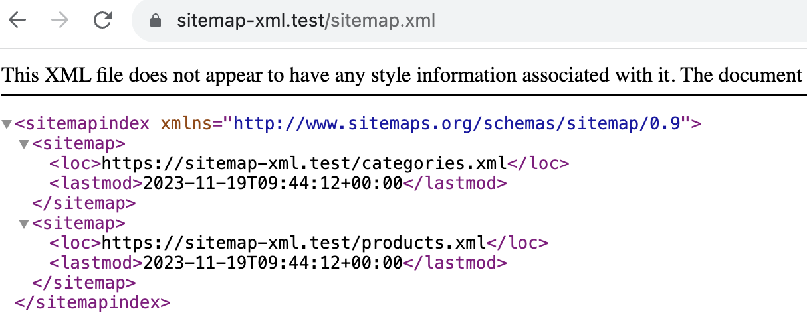
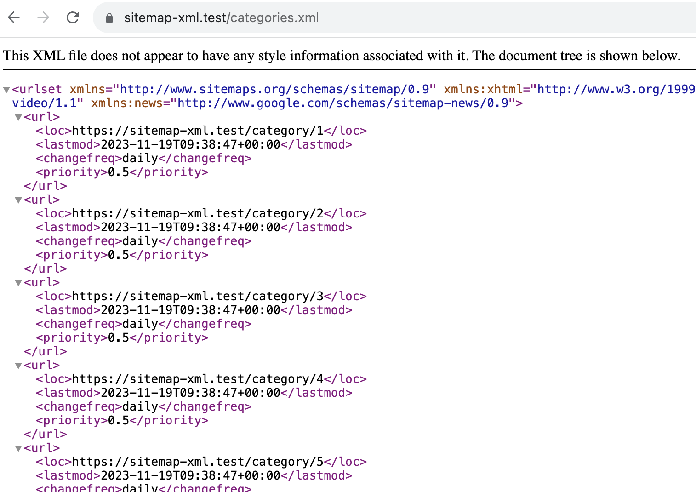
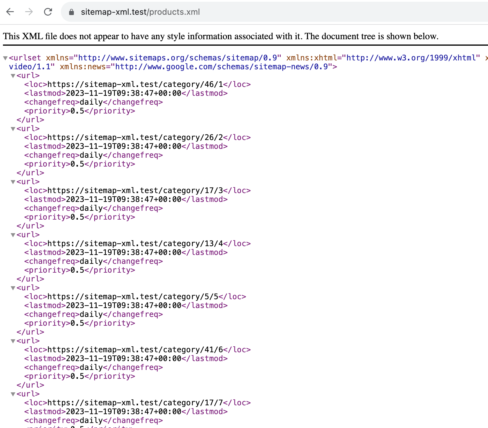

## Laravel v10 | Sitemap.xml Generator

[Link](https://github.com/spatie/laravel-sitemap) (laravel-sitemap)

## Setup

```
composer install

php artisan db:seed

php artisan site-map-generate
```

[app/Console/Commands/SiteMapGenerate.php](https://github.com/nAa6666/laravel-sitemap/blob/main/app/Console/Commands/SiteMapGenerate.php)

```
Start generating sitemap...
Categories count: 50
Products count: 200
Sitemap generated successfully!
```




